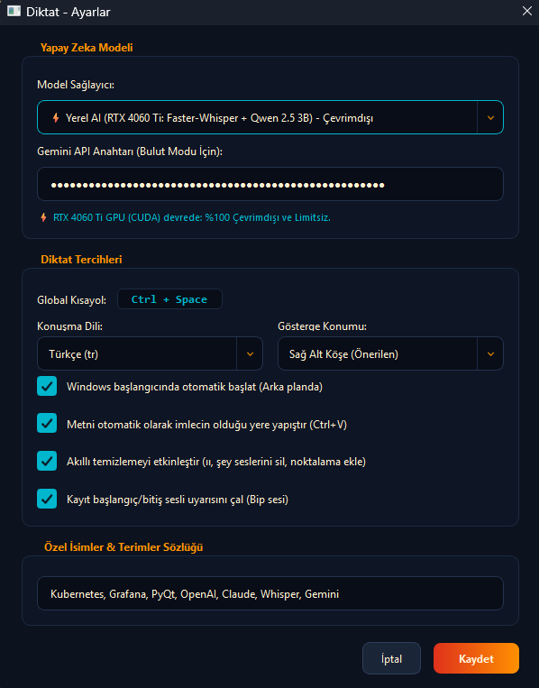

# 🎙️ Diktat — Zero-Friction AI Voice Dictation for Windows

<p align="center">
  
</p>

**Diktat**, Windows üzerinde herhangi bir uygulamada (Word, VS Code, Not Defteri, WhatsApp, Chrome, Slack vb.) **`Ctrl + Space`** tuşuna basarak konuştuğunuz her şeyi anında yazıya döken ve yapay zeka ile otomatik temizleyerek imlecinizin durduğu yere yapıştıran ultra hızlı, hafif bir masaüstü asistanıdır.

---

## ✨ Özellikler

- 🚀 **Sıfır Sürtünme (Zero Friction)**: Ekranda gereksiz pencereler açılmaz; arka planda sistem tepsisinde (System Tray) sessizce bekler.
- 💻 **%100 Yerel AI Desteği (GPU / CUDA)**: NVIDIA RTX ekran kartınızda çalışan **`faster-whisper (large-v3-turbo)`** ve dahili **`Qwen 2.5 3B (4-bit GGUF)`** modelleri ile sıfır internet, sıfır kota ve maksimum gizlilik ile tam çevrimdışı çalışma.
- 🎯 **Doğrudan İmlece Yapıştırma**: İmleciniz neredeyse oraya anında (`Ctrl + V`) yazar.
- ⚡ **Ultra Hızlı Pipeline**: İster yerel GPU ister Gemini 3.7 Flash motoru ile konuşma biter bitmez milisaniyeler içinde metne çevrilir.
- 🧹 **Akıllı Konuşma Temizleme**: "ıı", "şey", "yani", "hani" gibi düşünme seslerini, kekelemeleri ve tekrarları otomatik siler; noktalama işaretlerini ve büyük harfleri mükemmel ekler.
- 🔄 **Windows ile Otomatik Başlatma**: Ayarlardan tek tıkla Windows başlangıcında otomatik ve arka planda çalışma desteği.
- 📚 **Özel Terimler Sözlüğü (Glossary)**: Kodlama dilleri, teknik kavramlar (örn. *Kubernetes, Grafana, PyQt, Claude*) ve özel isimleri doğru yazar.
- 🔔 **Sesli & Görsel Geri Bildirim**: Kayıt başladığında/bittiğinde zarif bir bip sesi çalar ve ekranın köşesinde modern temalı mini kayıt göstergesi belirir.

---

## ⌨️ Kısayol Tuşları

| Kısayol | İşlem |
|---|---|
| **`Ctrl + Space`** | Diktatı Başlat / Durdur & Yapıştır |
| **`Ctrl + Alt + Space`** | Diktatı İptal Et |

---

## 🚀 Hızlı Başlangıç

### 1. Gereksinimler
- Windows 10 / 11
- Python 3.10+
- NVIDIA Ekran Kartı (RTX 4060 Ti veya benzeri CUDA destekli GPU) veya Bulut API Anahtarı

### 2. Kurulum
```bash
git clone https://github.com/KavalMesut/diktat.git
cd diktat

pip install -r requirements.txt
```

### 3. Modelleri İndirme (Yerel Mod İçin)
```bash
python download_local_models.py
```

### 4. Çalıştırma
```bash
python diktat.py
# veya
run_diktat.bat
```

---

## 🗺️ Yol Haritası / Gelecek Planları (Roadmap & To-Do)

- [x] **%100 Çevrimdışı / Yerel Mod (Offline Local STT & LLM)**: `faster-whisper (large-v3-turbo)` + dahili `Qwen 2.5 3B / Qwen3 4B 4-bit GGUF` (llama-cpp CUDA) ve dinamik A/B test desteği tamamlandı.
- [ ] **🧠 Dinamik Kullanıcı Hafızası & Kişiselleştirme (Stephen Hawking / ACAT Modeli)**: Kullanıcı dikte ettikçe en çok kullandığı teknik terimleri, özel isimleri ve konuşma kalıplarını yerel olarak öğrenen, kişisel sözlüğü Whisper ve LLM istemine dinamik olarak enjekte eden ve kullanıcı düzeltmelerini hafızaya kaydeden akıllı öğrenme motoru.
- [ ] **🎙️ ReSpeaker Lite 2 Donanım & Uzak Alan (Far-Field) Ses Profili**: ReSpeaker Lite (XMOS DSP / 2-mic beamforming) aygıtı için gürültülü ortamlarda ve uzak mesafeden diktede ses karakteristiğine özel VAD (Voice Activity Detection) kalibrasyonu, dinamik ses normalizasyonu ve uzak alan kazanç optimizasyonu.
- [ ] **Hibrit Mod (Yerel Whisper STT + Bulut Gemini Flash-Lite LLM)**: Ses tanımanın yerel GPU'da (`faster-whisper`), yalnızca metin temizleme ve imla düzenleme işleminin bulutta ultra hafif `Gemini 3.5 / 3.7 Flash-Lite` ile yapıldığı hibrit sağlayıcı modu.
- [ ] **Çoklu API Sağlayıcıları & Akıllı Fallback**: OpenAI Whisper, Groq, Anthropic Claude ve DeepSeek API entegrasyonu.
- [ ] **Bas-Konuş (Push-to-Talk) Modu**: Tuşa basılı tutulduğu sürece kaydedip bırakınca anında yapıştırma seçeneği.
- [ ] **Ses Dosyası Transkripsiyonu**: `.mp3`, `.wav`, `.m4a` ses kayıtlarını doğrudan sürükle-bırak ile metne dökme.

---

## 📄 Lisans
Bu proje [MIT Lisansı](LICENSE) ile lisanslanmıştır.
